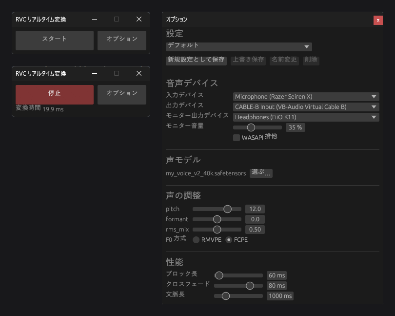
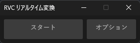
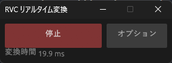
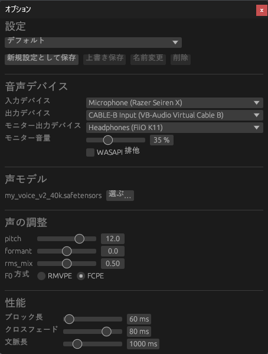
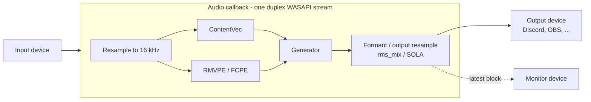

<div align="center">

# RVC Realtime (Rust)

> 0.1.10-alpha integrates the C1 conversion path and reduces CPU waiting during GPU analysis while preserving the tested C1 audio output. GPU usage varies between runs; a GPU reduction or audible quality improvement is not claimed. See the [0.1.10 update record](docs/releases/0.1.10-alpha.md). LibTorch and Python are not runtime dependencies. Public redistribution of the bundled upstream assets still requires a separate final check.

**A realtime RVC voice changer for Windows, written in Rust — no Python at runtime.**

It ports the realtime path of the official [RVC WebUI](https://github.com/RVC-Project/Retrieval-based-Voice-Conversion-WebUI) 2.3.260718 line by line, runs it on ONNX Runtime with CUDA Graphs, and checks it stage by stage against the official Python.


[日本語はこちら](#日本語)



</div>

---

## Why

- **One small exe instead of a Python stack.** No conda, no pip, no torch install. Pick your RVC model file and press Start.
- **The official algorithm, not an approximation.** Every buffer length, resample, pitch cache and SOLA step follows the official `RVCStreamEngine`. Correctness is measured against the official code, not eyeballed.
- **Light on the GPU.** It is built to run next to games, OBS and Discord. No background busy-work keeps the GPU spinning.

## Features

| | |
|---|---|
| 🎙️ **Realtime conversion** | One full-duplex WASAPI stream, converting inside the audio callback, as the official realtime GUI and VCClient do |
| 🎁 **Works out of the box** | A redistributable default voice (MIT) is bundled and selected until you pick your own model |
| 📦 **Use your model file as is** | `.pth` (official training output) and `.safetensors` load directly; they are converted in Rust in under a second on first start |
| 🗣️ **Breath stays breath** | Unvoiced frames (breath, consonants, room noise) stay unvoiced instead of being given the neighbouring pitch, as in the older official code and the Deiteris VCClient fork |
| 🎚️ **Official parameters** | pitch, formant, rms_mix, RMVPE / FCPE, block / crossfade lengths with the official ranges, and context up to 10 s |
| 🔁 **Change settings while running** | pitch, rms_mix, the silence settings and monitor volume apply instantly; everything else restarts the engine automatically |
| 🎧 **Monitor output** | Hear yourself on a second device at its own volume, without changing what goes to Discord or OBS. Its own clock is absorbed by a queue, so it does not click |
| 🤫 **Idle on silence** | While nobody speaks, the models stop running: GPU usage drops to 0 %. The first loud block resumes at once |
| 💾 **Named settings** | Save, overwrite, rename and delete whole configurations (devices, model, voice, performance) |
| 🔊 **WASAPI exclusive** | The same option as the official GUI |
| 🪶 **Small, simple UI** | A Start button and an Options window that sizes itself to its content |

## Numbers

Measured on an RTX 3060 Ti with the `lowlat-fcpe` configuration (block 60 ms, crossfade 80 ms, context 1000 ms, FCPE, 48 kHz device), the default up to 0.1.5. The 0.1.6 default (RMVPE) takes about 19 ms per block back-to-back.

| What | Result |
|---|---|
| Block time at real-time pace | p50 **15.7 ms**, p95 21.2 ms (for a 60 ms block) |
| GPU usage while converting (Task Manager, 3D) | **~24–32 %** |
| Match with the official Python (same generator noise) | pitch frames **100 %** equal, log-mel L1 0.030, F0 RMSE 4.3 cents |
| Voice model conversion (`.safetensors` → engine files) | **< 1 s** |
| Engine start, warm | ~1.5 s |

How these were measured is written down in [`PoC/01-rust-ort-official-rt/RESULTS.md`](PoC/01-rust-ort-official-rt/RESULTS.md), [`PoC/02-rust-ort-dynamic-shape/RESULTS.md`](PoC/02-rust-ort-dynamic-shape/RESULTS.md) and [`docs/plans/rvc-app/design.md`](docs/plans/rvc-app/design.md).

## Screenshots

| Idle | Converting | Options |
|---|---|---|
|  |  |  |

## How it works



- **`crates/rvc-engine`** — the engine library.
  - `Engine` converts one block (a port of `RVCStreamEngine.process` + `rtrvc.RVC.infer`).
  - `Realtime` owns the audio devices.
  - `voice_model` turns a `.pth` / `.safetensors` into engine files.
- **`crates/rvc-app`** — the Windows app (egui).
- **ONNX Runtime + CUDA Graphs.** Every length is fixed when the engine starts, so each model runs as a captured CUDA graph with pre-bound GPU buffers.
- **Rust-only model conversion.** The generator graph is shipped once per official training config (32k / 40k / 48k) with its weights as external data. Converting a model means reading its tensors (including a minimal unpickler for torch `.pth`) and writing them at fixed offsets, the way the official loader does (fp32 → `remove_weight_norm` → fp16).

## Status

**Alpha.** It works day to day on the author's machine; expect rough edges.

- ✅ RVC **v2** models **with F0** trained with the official configs.
  - 40k is verified with a real model.
  - 32k and 48k are verified against torch with random weights.
- ❌ Not supported yet: RVC v1, models without F0, index files, noise suppression, CPU / AMD / Intel GPUs, macOS / Linux.
- 📦 The runtime DLLs and ONNX assets are not in this repository. Building from source needs the dev tools below.

## Download

The Windows installer (`RVC-Realtime-<version>-alpha.msi`) is on the [Releases](https://github.com/Ramo-Inc/rvc-realtime/releases) page. It bundles CUDA, cuDNN and ONNX Runtime; you only need an NVIDIA GPU with a driver that supports CUDA 13. Installing a newer version updates the existing install in place.

## Build from source

Requirements: Windows 10/11 x64, an NVIDIA GPU with a driver that supports CUDA 13, Rust (stable), and — for generating assets only — Python with [uv](https://github.com/astral-sh/uv).

1. **Runtime DLLs** (CUDA 13, cuDNN 9):
   ```bash
   uv run --project PoC/tools python PoC/tools/fetch_runtime.py --out PoC/01-rust-ort-official-rt/runtime
   ```
   Also copy `libportaudio64bit.dll` from the `sounddevice` 0.5.6 wheel into that folder.
2. **Official RVC as the reference.** Clone [RVC-Project/Retrieval-based-Voice-Conversion-WebUI](https://github.com/RVC-Project/Retrieval-based-Voice-Conversion-WebUI) at `81eed5e` into `PoC/assets/official/rvc`, with its `hubert_base` and `rmvpe` assets.
3. **ONNX assets.** These are exported once, from any RVC v2 40k F0 model:
   ```bash
   uv run --project PoC/tools python PoC/tools/export_onnx_dynamic.py
   uv run --project PoC/tools python PoC/tools/export_generator_template.py --out PoC/assets/app --model path/to/model.pth --check
   ```
   Copy `contentvec.onnx`, `rmvpe.onnx` and `fcpe.onnx` into `PoC/assets/app/`.

   Default voice: download [`default.pth`](https://huggingface.co/PhoenixStormJr/RVC-V2-default-voice/resolve/main/default.pth) (MIT) to `PoC/assets/app/voices/default_v2_40k.pth`.
4. **Build and run:**
   ```bash
   cd crates/rvc-app
   cargo build --release
   cmd /c mklink /J target\release\runtime ..\..\PoC\01-rust-ort-official-rt\runtime
   cmd /c mklink /J target\release\assets  ..\..\PoC\assets\app
   target\release\rvc-app.exe
   ```

Engine tests: `cargo test --release` in `crates/rvc-engine`.

## FAQ

**Is the sound the same as the official RVC realtime GUI?**
It follows the same algorithm and matches the official output at the measured stages (see *Numbers*). Waveforms are not bit-identical: SOLA picks its offset from float near-ties, which even the official GPU and CPU runs disagree on.

**Why not keep the GPU busy to shave a few milliseconds?**
An earlier build did that with a 1 ms background CUDA op. Block time dropped a little, but Task Manager showed the GPU pinned at ~95 % and other apps stuttered. It was removed. A 60 ms block converts in about 16 ms without it.

**Does it need Python?**
Not to run. Python is only used by the dev tools that generate the ONNX assets and check parity against the official code.

**Can I use a model from VCClient or Applio?**
A v2 F0 model with the official generator settings and the ContentVec embedder works (`.pth` or `.safetensors`). Models with other embedders or vocoders are reported as unsupported instead of producing broken audio.

## Acknowledgements

- [RVC-Project / Retrieval-based-Voice-Conversion-WebUI](https://github.com/RVC-Project/Retrieval-based-Voice-Conversion-WebUI) — the algorithm this project reproduces.
- [PhoenixStormJr / RVC-V2-default-voice](https://huggingface.co/PhoenixStormJr/RVC-V2-default-voice) — the bundled default voice (MIT).
- [w-okada / voice-changer (VCClient)](https://github.com/w-okada/voice-changer) — the audio and monitor design this app follows.
- [ONNX Runtime](https://onnxruntime.ai/) and [`ort`](https://github.com/pykeio/ort), [egui / eframe](https://github.com/emilk/egui), [PortAudio](http://www.portaudio.com/), [RMVPE](https://github.com/Dream-High/RMVPE), [torchfcpe](https://github.com/CNChTu/FCPE), [ContentVec](https://github.com/auspicious3000/contentvec).

### Default voice model

The app ships with one voice model so it works before you add your own:

| | |
|---|---|
| Model | [PhoenixStormJr / RVC-V2-default-voice](https://huggingface.co/PhoenixStormJr/RVC-V2-default-voice) (`default.pth`, bundled as `voices/default_v2_40k.pth`) |
| Format | RVC v2, 40 kHz, with F0 |
| License | MIT — free to use, modify and redistribute, including commercially. The license text is shipped next to the model (`voices/default_v2_40k.LICENSE.txt`). |

It is used only until you choose your own model in Options.

## License

Not decided yet.

---

<a id="日本語"></a>

## 日本語

**Python なしで動く、Windows 用のリアルタイム RVC ボイスチェンジャーです（Rust 製）。**

公式 RVC WebUI 2.3.260718 のリアルタイム変換を 1 行ずつ移植しました。ONNX Runtime と CUDA Graph で動かし、公式の Python と段階ごとに照合しています。

### ダウンロード

Windows 用のインストーラー（`RVC-Realtime-<バージョン>-alpha.msi`）は [Releases](https://github.com/Ramo-Inc/rvc-realtime/releases) にあります。CUDA・cuDNN・ONNX Runtime は同梱しているので、必要なのは CUDA 13 対応ドライバーの NVIDIA GPU だけです。新しい版を入れると、前の版のフォルダがそのまま更新されます。

### できること

- **すぐ試せる:** 再配布できる既定の声モデル（MIT）が入っていて、自分のモデルを選ぶまではそれが使われます。
- **声モデルをそのまま使える:** `.pth` / `.safetensors` を選ぶだけです。初回のスタート時に、Rust で 1 秒未満で変換します。
- **息は息のまま:** 息・子音・部屋の雑音を、前後の声の高さで埋めずに無声のまま変換します（旧版の公式と Deiteris 版 VCClient と同じ）。
- **公式と同じパラメータ:** pitch、formant、rms_mix、RMVPE / FCPE、ブロック長・クロスフェード・文脈長。範囲も公式と同じです。
- **変換中に設定を変えられる:** pitch・rms_mix・無音の設定・モニター音量はその場で反映します。それ以外は自動で作り直して再開します。
- **モニター出力:** 配信や通話に送る音とは別に、自分の声を別のデバイスで、別の音量で聴けます。機器ごとの時計のズレは待ち行列で吸収するので、プチ音が入りません。
- **無音のときは変換しない:** 黙っている間はモデルを動かさず、GPU 使用率が 0% になります。声が出たらすぐ戻ります。
- **名前付きの設定:** デバイス、声モデル、声の調整、性能をまとめて、保存・上書き・名前変更・削除できます。
- **WASAPI 排他:** 公式 GUI と同じ選択肢です。
- **シンプルな画面:** スタートとオプションだけです。オプション窓は中身に合わせた大きさで開きます。

### 数字（RTX 3060 Ti、block 60 ms / FCPE）

- **1 ブロックの処理時間:** 中央値 15.7 ms（60 ms のブロックに対して）。
- **変換中の GPU 使用率:** タスクマネージャーの 3D で約 24〜32%。
- **公式との一致:** 同じ雑音で比べて、ピッチは 100% 一致、log-mel L1 は 0.030。

### クレジット（既定の声モデル）

アプリには、自分の声モデルを用意する前から試せるように、ライセンス上自由に使える声モデルを 1 つ入れています。

- **モデル:** [PhoenixStormJr / RVC-V2-default-voice](https://huggingface.co/PhoenixStormJr/RVC-V2-default-voice)（`voices/default_v2_40k.pth` として同梱）
- **形式:** RVC v2、40 kHz、F0 あり
- **ライセンス:** MIT です。改変、再配布、商用利用も自由です。ライセンス文はモデルの横（`voices/default_v2_40k.LICENSE.txt`）に同梱しています。
- **使われる場面:** オプションで自分の声モデルを選ぶまでの間だけです。

### 状態

アルファ版です。
- **対応している声モデル:** 公式の学習設定で作った RVC v2（F0 あり）です。
- **リポジトリに無いもの:** ランタイムの DLL と ONNX。ソースからビルドするときは、上の「Build from source」の手順で用意します。
