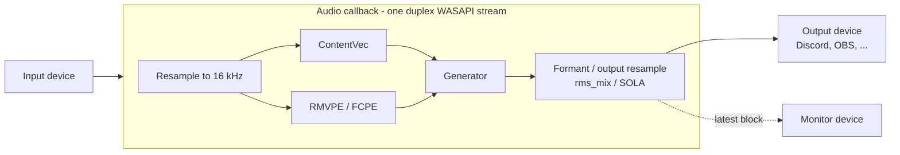

<div align="center">

# RVC Realtime (Rust)

**A realtime RVC voice changer for Windows, written in Rust — no Python at runtime.**

Version 0.1.8 adds the complete no-index/RMVPE conversion path used by the [Deiteris VCClient fork](https://github.com/deiteris/voice-changer), including its stateful F0, volume/silence, generator and SOLA processing. The entire product path runs on ONNX Runtime; LibTorch and Python are not runtime dependencies.


[日本語はこちら](#日本語)


</div>

---

## Why

- **No Python stack at runtime.** No conda, pip or separate server. Pick your RVC model file and press Start.
- **Two conversion paths.** New installations default to the Deiteris no-index/RMVPE path; existing settings remain on the previous official-RVC ONNX path until changed.
- **Measured, not guessed.** Buffer lengths, state and each conversion stage are checked against their upstream implementations. This is still an alpha; known limitations are listed below.

## Features

| | |
|---|---|
| 🎙️ **Realtime conversion** | One full-duplex WASAPI stream, converting inside the audio callback, as the official realtime GUI and VCClient do |
| 🎁 **Works out of the box** | A redistributable default voice (MIT) is bundled and selected until you pick your own model |
| 📦 **Use your model file as is** | `.pth` (official training output) and `.safetensors` load directly; they are converted in Rust in under a second on first start |
| 🗣️ **Breath stays breath** | Unvoiced frames (breath, consonants, room noise) stay unvoiced instead of being given the neighbouring pitch, as in the older official code and the Deiteris VCClient fork |
| 🎚️ **Conversion-path controls** | Deiteris: pitch, formant, chunk, crossfade, extra context and silence threshold. Legacy: pitch, formant, rms_mix, RMVPE / FCPE, block / crossfade and context |
| 🔁 **Change settings while running** | pitch, rms_mix, the silence settings and monitor volume apply instantly; everything else restarts the engine automatically |
| 🎧 **Monitor output** | Hear yourself on a second device at its own volume, without changing what goes to Discord or OBS. Its own clock is absorbed by a queue, so it does not click |
| 🤫 **Optional idle on silence** | Available on the legacy path. The Deiteris path keeps its original volume/silence state handling |
| 💾 **Named settings** | Save, overwrite, rename and delete whole configurations (devices, model, voice, performance) |
| 🔊 **WASAPI exclusive** | The same option as the official GUI |
| 🪶 **Small, simple UI** | A Start button and an Options window that sizes itself to its content |

## Numbers

0.1.8 Deiteris-path measurement on an RTX 3060 Ti, 48 kHz, chunk 19 (50.67 ms), 60 seconds at real-time cadence. This is a local alpha measurement, not a general hardware guarantee.

| What | Result |
|---|---|
| Steady block time | p50 **25.13 ms**, p95 28.18 ms, p99 30.13 ms (50.67 ms period) |
| Deadline stability | 0 misses in one 1185-block run; 3 slow blocks in a repeat run, still under investigation |
| GPU usage while converting (Task Manager, process 3D) | about **61.8 %** average in the repeat run |
| Legacy-path regression | seed-7 WAV remains byte-identical to the 0.1.6 baseline |

Block time is taken from the engine's own timing at real-time pace. GPU usage is the Task Manager figure (`GPU Engine 3D`, summed), because `nvidia-smi` under-reports it. Parity uses the official Python with the same generator noise.

## Screenshots

| Idle | Converting | Options |
|---|---|---|
|  |  |  |

## How it works



- **`crates/rvc-engine`** — the device-independent `Processor` plus realtime audio devices.
  - `Engine` converts one block (a port of `RVCStreamEngine.process` + `rtrvc.RVC.infer`).
  - `Realtime` owns the audio devices.
  - `voice_model` turns a `.pth` / `.safetensors` into engine files.
- **`crates/rvc-app`** — the Windows app (egui).
- **`crates/rvc-deiteris`** — the Deiteris state machine and ONNX generator. The generator is created, processed and destroyed on one owning thread.
- **`crates/rvc-model`** — the shared `.pth` / `.safetensors` reader.
- **ONNX Runtime + CUDA Graphs.** Every length is fixed when the engine starts. Python/Torch are used only for development-time exports and comparisons.
- **Rust-only model conversion.** The generator graph is shipped once per official training config (32k / 40k / 48k) with its weights as external data. Converting a model means reading its tensors (including a minimal unpickler for torch `.pth`) and writing them at fixed offsets, the way the official loader does (fp32 → `remove_weight_norm` → fp16).

## Status

**Alpha.** It works day to day on the author's machine; expect rough edges.

- ✅ RVC **v2** models **with F0** trained with the official configs.
  - 40k is verified with a real model.
  - 32k and 48k are verified against torch with random weights.
- ❌ Not supported yet: RVC v1, models without F0, index files, noise suppression, CPU / AMD / Intel GPUs, macOS / Linux.
- ⚠️ 44.1 kHz still has an unresolved voiced/unvoiced difference from the pinned upstream comparison. 32k/48k voice structures are checked, but their real-audio quality is not yet accepted.
- ⚠️ The 44.1 kHz / short-extra owner/direct comparison remains below the project acceptance threshold. 0.1.9 is an alpha, not a bit-exact-output claim for every setting.
- 📦 The runtime DLLs and ONNX assets are not in this repository. Building from source needs the dev tools below.

## Download

The Windows installer (`RVC-Realtime-0.1.9-alpha.msi`) is on the [Releases](https://github.com/Ramo-Inc/rvc-realtime/releases) page. It is one self-contained MSI; no external CAB files are required. It bundles the runtime, so you only need an NVIDIA GPU with a current driver. Installing a newer version updates the existing install in place.

## Build from source

Requirements: Windows 10/11 x64, an NVIDIA GPU with a current driver, and Rust (stable). Python with [uv](https://github.com/astral-sh/uv) and PyTorch are needed only to export assets.

Everything generated or downloaded goes into `assets/` (git-ignored). Run the commands from the repository root.

1. **Runtime DLLs** (CUDA 13, cuDNN 9):
   ```bash
   uv run --project tools python tools/fetch_runtime.py --out assets/runtime
   ```
   Also copy `libportaudio64bit.dll` from the `sounddevice` 0.5.6 wheel into `assets/runtime`.
2. **Official RVC as the reference.** Clone [RVC-Project/Retrieval-based-Voice-Conversion-WebUI](https://github.com/RVC-Project/Retrieval-based-Voice-Conversion-WebUI) at `81eed5e` into `assets/official/rvc`, with its `hubert_base` and `rmvpe` assets.
3. **Default voice.** Download [`default.pth`](https://huggingface.co/PhoenixStormJr/RVC-V2-default-voice/resolve/main/default.pth) (MIT) to `assets/app/voices/default_v2_40k.pth`. The export tools also use it as their model.
4. **ONNX assets:**
   ```bash
   uv run --project tools python tools/export_onnx_dynamic.py --check
   uv run --project tools python tools/export_generator_template.py --out assets/app --model assets/app/voices/default_v2_40k.pth --check
   ```
   Copy `contentvec.onnx`, `rmvpe.onnx` and `fcpe.onnx` from `assets/onnx-dynamic/` into `assets/app/`.
5. **Deiteris assets.** The app expects `assets/app/deiteris/{pre,prepare,post,contentvec,rmvpe}.onnx` and `assets/app/deiteris/templates/{32k,40k,48k}/{generator.onnx,template.json}`. They are bundled in the release. `tools/export_deiteris_generator_template.py` reproduces the generator templates from a Deiteris checkout; the verified frontend graphs are not regenerated during a normal Rust build.
6. **Build and run:**
   ```bash
   cd crates/rvc-app
   cargo build --release
   cmd /c mklink /J target\release\runtime ..\..\assets\runtime
   cmd /c mklink /J target\release\assets  ..\..\assets\app
   target\release\rvc-app.exe
   ```

Engine tests: `cargo test --release` in `crates/rvc-engine` (needs steps 1–4).

The Windows installer is built with WiX Toolset 5 from `installer/rvc-app.wxs`; see the comment at the top of that file.

## FAQ

**Is the sound the same as the official RVC realtime GUI?**
It follows the same algorithm and matches the official output at the measured stages (see *Numbers*). Waveforms are not bit-identical: SOLA picks its offset from float near-ties, which even the official GPU and CPU runs disagree on.

**Why not keep the GPU busy to shave a few milliseconds?**
An earlier build did that with a 1 ms background CUDA op. Block time dropped a little, but Task Manager showed the GPU pinned at ~95 % and other apps stuttered. It was removed. A 60 ms block converts in about 16 ms without it.

**Does it need Python?**
Not to run. Python is only used by the dev tools that generate the ONNX assets and check parity against the official code.

**Can I use a model from VCClient or Applio?**
A v2 F0 model with the official generator settings and the ContentVec embedder works (`.pth` or `.safetensors`). Models with other embedders or vocoders are reported as unsupported instead of producing broken audio.

## Acknowledgements

- [RVC-Project / Retrieval-based-Voice-Conversion-WebUI](https://github.com/RVC-Project/Retrieval-based-Voice-Conversion-WebUI) — the algorithm this project reproduces.
- [PhoenixStormJr / RVC-V2-default-voice](https://huggingface.co/PhoenixStormJr/RVC-V2-default-voice) — the bundled default voice (MIT).
- [w-okada / voice-changer (VCClient)](https://github.com/w-okada/voice-changer) — the audio and monitor design this app follows.
- [ONNX Runtime](https://onnxruntime.ai/) and [`ort`](https://github.com/pykeio/ort), [egui / eframe](https://github.com/emilk/egui), [PortAudio](http://www.portaudio.com/), [RMVPE](https://github.com/Dream-High/RMVPE), [torchfcpe](https://github.com/CNChTu/FCPE), [ContentVec](https://github.com/auspicious3000/contentvec).

### Default voice model

The app ships with one voice model so it works before you add your own:

| | |
|---|---|
| Model | [PhoenixStormJr / RVC-V2-default-voice](https://huggingface.co/PhoenixStormJr/RVC-V2-default-voice) (`default.pth`, bundled as `voices/default_v2_40k.pth`) |
| Format | RVC v2, 40 kHz, with F0 |
| License | MIT — free to use, modify and redistribute, including commercially. The license text is shipped next to the model (`voices/default_v2_40k.LICENSE.txt`). |

It is used only until you choose your own model in Options.

## License

Not decided yet.

---

<a id="日本語"></a>

## 日本語

**Python なしで動く、Windows 用のリアルタイム RVC ボイスチェンジャーです（Rust 製）。**

公式 RVC WebUI 2.3.260718 のリアルタイム変換を 1 行ずつ移植しました。ONNX Runtime と CUDA Graph で動かし、公式の Python と段階ごとに照合しています。

### ダウンロード

Windows 用インストーラー `RVC-Realtime-0.1.9-alpha.msi` は [Releases](https://github.com/Ramo-Inc/rvc-realtime/releases) にあります。単体で完結しており、外部CABは不要です。ランタイムは同梱しているので、必要なのは現行ドライバーのNVIDIA GPUです。新しい版を入れると、前の版のフォルダがそのまま更新されます。

### できること

- **すぐ試せる:** 再配布できる既定の声モデル（MIT）が入っていて、自分のモデルを選ぶまではそれが使われます。
- **声モデルをそのまま使える:** `.pth` / `.safetensors` を選ぶだけです。初回のスタート時に、Rust で 1 秒未満で変換します。
- **息は息のまま:** 息・子音・部屋の雑音を、前後の声の高さで埋めずに無声のまま変換します（旧版の公式と Deiteris 版 VCClient と同じ）。
- **2つの変換経路:** 新規設定はDeiterisのindexなし/RMVPE経路です。従来経路も残してあり、既存設定は自動で切り替わりません。
- **変換中に設定を変えられる:** pitch・rms_mix・無音の設定・モニター音量はその場で反映します。それ以外は自動で作り直して再開します。
- **モニター出力:** 配信や通話に送る音とは別に、自分の声を別のデバイスで、別の音量で聴けます。機器ごとの時計のズレは待ち行列で吸収するので、プチ音が入りません。
- **無音のときは変換しない:** 黙っている間はモデルを動かさず、GPU 使用率が 0% になります。声が出たらすぐ戻ります。
- **名前付きの設定:** デバイス、声モデル、声の調整、性能をまとめて、保存・上書き・名前変更・削除できます。
- **WASAPI 排他:** 公式 GUI と同じ選択肢です。
- **シンプルな画面:** スタートとオプションだけです。オプション窓は中身に合わせた大きさで開きます。

### 0.1.8の数字（RTX 3060 Ti、48 kHz / chunk 19）

- **定常1ブロック:** 中央値25.13 ms、p99 30.13 ms（50.67 ms周期）。
- **安定性:** 1回目は期限超過0/1185、再測定は遅いブロック3/1185。継続調査中です。
- **GPU使用率:** 再測定でタスクマネージャーのプロセス3D平均約61.8%。

### クレジット（既定の声モデル）

アプリには、自分の声モデルを用意する前から試せるように、ライセンス上自由に使える声モデルを 1 つ入れています。

- **モデル:** [PhoenixStormJr / RVC-V2-default-voice](https://huggingface.co/PhoenixStormJr/RVC-V2-default-voice)（`voices/default_v2_40k.pth` として同梱）
- **形式:** RVC v2、40 kHz、F0 あり
- **ライセンス:** MIT です。改変、再配布、商用利用も自由です。ライセンス文はモデルの横（`voices/default_v2_40k.LICENSE.txt`）に同梱しています。
- **使われる場面:** オプションで自分の声モデルを選ぶまでの間だけです。

### 状態

アルファ版です。
- **対応している声モデル:** 公式の学習設定で作った RVC v2（F0 あり）です。
- **リポジトリに無いもの:** ランタイムの DLL と ONNX。ソースからビルドするときは、上の「Build from source」の手順で用意します。
